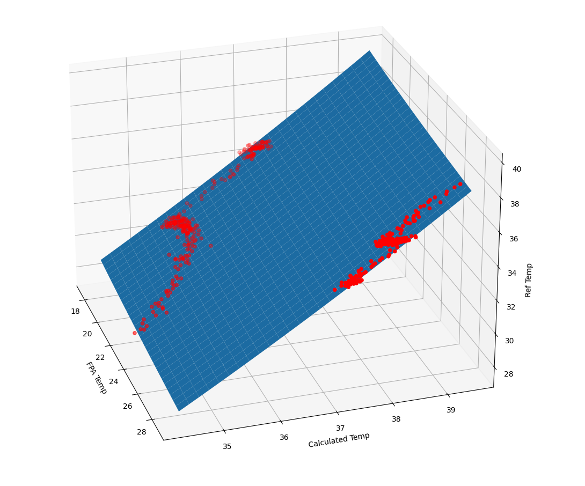

# SACLeptonRPi
Flir lepton 80x60 sensor and RPi 3B symbiosys

Neural network installation: https://github.com/tensorflow/tensorflow/issues/36141?fbclid=IwAR0d4MILHB_GreDxLU-YguQiNk__Gjb3_gvgaCV7GI_SVz65TxI18XAMd-Q

NSC2 installation: https://www.pyimagesearch.com/2019/04/08/openvino-opencv-and-movidius-ncs-on-the-raspberry-pi/

sudo addgroup users

Service creation:

cd /lib/systemd/system

sudo nano SACLeptonRPi.service

To test if it works: sudo systemctl start SACLeptonRPi.service

If so:

sudo systemctl daemon-reload

sudo systemctl stop SACLeptonRPi.service

sudo systemctl enable SACLeptonRPi.service

## 'Mechanics'
* `/home/pi/SACLeptonRPi/SACLeptonRPi.sh`
  1. runs openVINO setupvars script (under `~/openvino/bin/setupvars.sh`)
  1. starts `~/SACLeptonRPi/Main.py`
* `~/SACLeptonRPi/Main.py` starts openGLes display thread `/home/pi/SACLeptonRPi/SACDisplayMixer/OGLESSimpleImageWithIPC`
* `~/SACLeptonRPi/Main.py` periodically calls state machine `~/SACLeptonRPi/SACOnScreenDisplay/StateMachine.py´

## Measuring method
An estimation of a test person's core temperature can be done by measuring the person's forehead temperature. Based to the article *Investigation of the Impact of Infrared Sensors on Core Body Temperature Monitoring by Comparing Measurement Sites* (https://www.ncbi.nlm.nih.gov/pmc/articles/PMC7284737/) by Hsuan-Yu Chen, Andrew Chen and Chiachung Chen.

This application uses an 80 x 60 uncooled microbolometer array (Flir Lepton 2.5) for no-contact core temperature estimation.

## Hardware limitations
  * The hardware is to be used indoors and in an environment with limited temperature range (e.g. 10°C ... 30°C).
  * The unit is very sensitive to ambient temperature fluctuations. When changing environments, leave the unit to settle for about 1 hour.
  * The unit measures the forehead __skin__ temperature, which is only an indication of a person's core temperature. This temperature largely dependent on external factors.

## Software description
### Initialization
  * Upon startup: the software sets the Flux Linear parameters in the Thermal imaging sensor (for window, ambient and background compensation). The software is currently using the Thermal imaging sensor housing temperature as ambient temperature.

### Detection and measurement Loop
  * Detect a face using a convolutional neural network implemented in openCV
  * Wait until the face is close enough by measuring its width
  * Set the region of interest (ROI) to the forehead region. This is currently done by taking the top 1/3rd of the returned face bounding box
  * Map the region of interest to the Thermal imaging sensor image using an affine transform
  * Perform a flat field calibration (FFC) on the Thermal imaging sensor on every measurement
  * Read back temperatures from the Thermal imaging sensor via the SPI (4 times, every 0.5s, depends on settings)
  * Wait to go back to idle state until detected face is gone
  * The average of maximum temperatures in the ROI, including a correcion accounting for FPA temperature and scene temperature fluctuations, is taken as the temperature of the forehead

## Calibration
Each unit shall be calibrated before usage. Calibration consists of
* measuring various scene temperatures in various ambient temperatures
* fitting the measurements to a plane Ref_Temp = f(FPA_temp, sensor_output).

### Example calibration on prototype
Surface function = a * (x^b) * (y^c)
with:
  * a = 0.011421541
  * b = -0.083873324
  * c = 2.283353429

In figure below, calculated temp is the average maximum sensor value over N samples in the ROI.

  ### Results
  115 Measurements on different healthy persons resulted in:
  
  Average forehead temperature (degC) | Stddev | Coefficient of variation (CV%) 
  ----------------------------------- | ------ | ------------------------------
  33.324 | 0.560 |1.680
